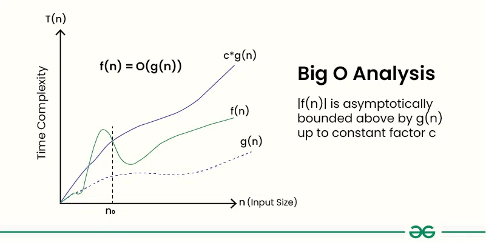

# What does the Big O notation do? How does it help in analyzing the algorithm?
```
In a Laymann Language we can say Big O notations are use to tell how much 
a algorithm takes to execute it's tasks.
```
```
Definition:
There are two function f(n) and g(n), where f(n) is defined as the big O of g(n).
==> f(n) = O(g(n))
with these neccessary condition:
if there exists a constants c & n_0
c > 0 and n_0 >= 0
where get: 
----------------------------------
f(n) <= c * g(n) for all n >= n_0.
----------------------------------
Through which we derive that f(n) increases les faster than g(n) for all 
n >= n_0.
```


# Best, Average and Worst Case scenario for search operations.
```
Best case:
Linear Search - O(1)
Binary Search - o(1)

Average Case:
Linear Search - O(n/2) or O(n)
Binary Search - O(log n)

Worst Case: 
Linear Search - O(n)
Binary Searc - O(log n) 
```

# Analysis 

```
Comparition of Linear Search & Binary Search
In case of Best case scenarios we can rely on both search strategies 
becasue they both produce O(1) time complexity.

But in case of Aerage Case which actually give the larger picture:
we can clearly say Binary search is better due to O(log n) time
complexity where the Linear search produce O(n/2) or O(n) time 
complexity. 

Also, to confirm our analyis we can look into worst cases which is
also the same in this case. 
Thus Binary search is better for searching products in a e-commerce application.

Few reasons:
1. Search completes in less steps.
2. Search is faster in average cases. Required for real world scenario.
3. Logarithmic time complexity is considered far better than O(N).
```